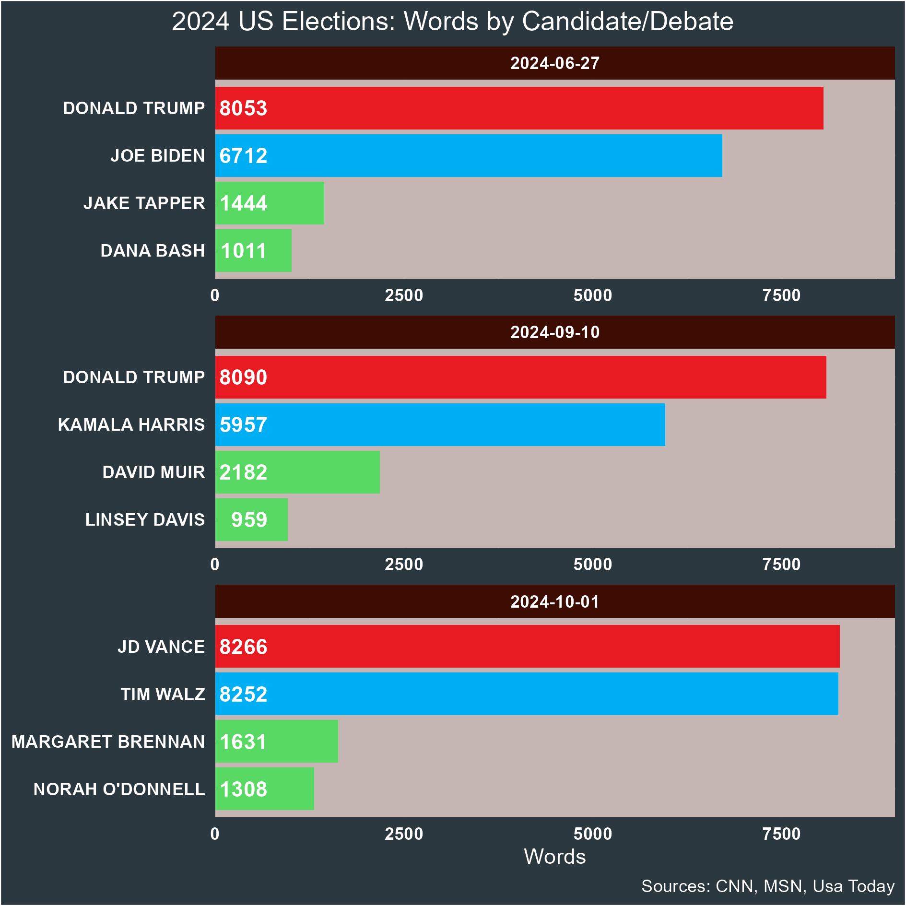

# 2024 Presidential Debates. Text Analysis

## Goals
### General Goal
Establish and compare the main trends in the candidates' arguments.

### Specific Goals
1. Quantitative: Number of words used by each candidate.
2. Most used words.
3. Negative and positive associations of the most used words.
4. Within debate comparison: Which words were used the most by each candidate? Comparison in the use of similar words, if any.
5. Between debate comparison: Differences by party. For Trump, differences in time.

## Scope
### In Scope
Obtaining metrics of the main trends for each candidate and, when possible, compare them to those of the other candidates.
### Out of Scope
1. Comparison with previous elections (e.g. with Biden and Trump in 2020).
2. Doing the same in other languages (e.g. Python).

## Tasks
Task      |Description         |Completed
----------|--------------------|---------
Find the transcripts|Download the different text from the internet.|Yes
Create a common data frame|We will create a data frame with three columns: Order of participation, Speaker, Text. Since the texts has different formats, this first task could be done using R or a Word processor. In this case we will use R. This effort can be time consuming, but the experience would be invaluable.|Yes
Count the words|We want to know how many words each candidate. The product is a data frame and a graphic|Working on it
Find the stop words file|Using the corresponding joins, we will control the number of relevant words|No
Obtain the most used words|Similar to the "Count the words" task. In this case we will work only with the relevant words|No

## Results
### Count the Words
#### Number of Words by Candidate/Debate
1. Trump is not the most vocal in total (both vice-president candidates articulated more words than him), however, he managed to surpass Biden and Harris. Determining the most used words remains a future task.
2. An unexpected result is that every time there was a pair of both sexes, women spoke less: candidates Harris and Trump, presenters Tapper and Bash, and Muir and Davis. Of course, this data is not enough to support the existence of a trend but is interesting.

### Most Used Words with Stop Words

####Goals

1. Number of unique words by candidate and debate.
2. Vocabulary diversity by candidate: number of unique words relative to the total number of words (DW/TW).
3. Number of relevant words (after applying the stop-words).

####Tasks

1. Unique words.
1.1. Create a data frame with the total number of words (including numbers) used by candidates in the debate. 1.2. This task includes filtering the data (no journalists), grouping by debate and candidate, and counting the number of rows.
1.3. Build a bar graph with the results. Start with a new ggplot graph. First, we must create a column with the candidates' names and the month of the debate (because Trump participated twice) and use this column as the X-axis.
2. Vocabulary diversity.
2.1. Starting with "debates_2024," filter the candidates and create a column candidate-month. Name this new data frame "debates_2024_candidate_month." 
2.2. With "debates_2024_candidate_month," build the data frame "debates_2024_candidate_month_total_words."  Group the data using the candidate-month column and create a column with the total of words (summarise command from dplyr).
2.3. With "debates_2024_candidate_month," build the data frame "debates_2024_candidate_month_unique_words." Group the data using the candidate-month column, and count the unique words (using the count command from dplyr).
2.4. Joint both data frames: "debates_2024_candidate_month_total_words" and "debates_2024_candidate_month_unique_words."
2.5. Apply the formula in a new column.
2.6. Build the corresponding graph.
3. Number of relevant words.
3.1. Improve the stop words: no numbers, no personal pronouns.
3.2. Apply the anti-join command to the data frame "debates_2024."
3.3. Repeat tasks in the section "Unique words."

## References
1. Schloss, P. [Connecting an Existing RStudio Project to Git and GitHub (CC145)](https://www.youtube.com/watch?v=bUoN85QvC10).
2. Silge, J. and Robinson, D. [Text Minning with R: A Tidy Approach](https://www.tidytextmining.com/). 

## License

<a property="dct:title" rel="cc:attributionURL" href="https://github.com/ortizpalanques1/debates_US_2024">Text Analysis of US 2024 Presidential Debates Using R</a> by <a rel="cc:attributionURL dct:creator" property="cc:attributionName" href="https://www.linkedin.com/in/marco-ortiz-palanques-710a556b/">Marco Ortiz Palanques</a> is licensed under <a href="https://creativecommons.org/licenses/by-nc/4.0/?ref=chooser-v1" target="_blank" rel="license noopener noreferrer" style="display:inline-block;">CC BY-NC 4.0</a>

